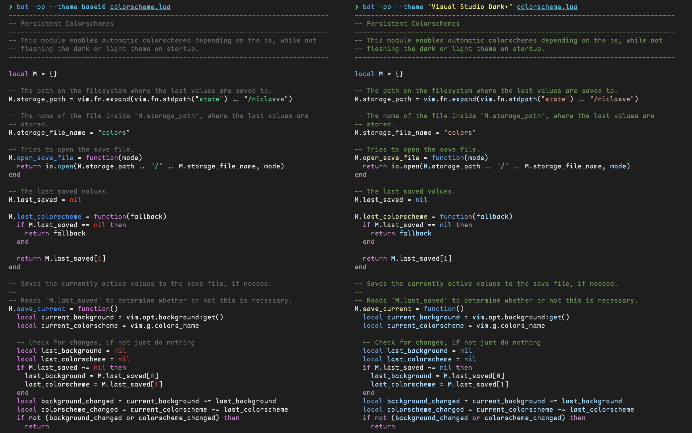

I prefer using light mode in bright environments and dark mode in darker ones.
To me, this just makes sense.
I don't want to be blinded by a screen when looking at my phone after waking up.
Similarly, I also don't want to have a hard time reading white text on a dark background during the day.

This is why I typically setup my computers to schedule dark mode around sunset and use light mode again after sunrise.
Most applications, such as apps, websites, etc. automatically adjust their theme to match the one of the operating system.
However, as a developer, one notable exception is the terminal.

## The Problem With Terminal Color Themes

<!--
TODO: Maybe talk about fundamentals here.
      Terminal text _includes_ styles, similar to inline styles in HTML.
-->

Terminals used bright text on a dark background even before operating system dark mode was a thing.
This is also why a lot of tools just assume dark mode, making.

There are terminals that can automatically change their color theme based on the system dark mode setting.
One example is [WezTerm](https://wezfurlong.org/wezterm), where you configure the terminal using Lua scripts and can adjust your color theme using the [`get_appearance` function](https://wezfurlong.org/wezterm/config/lua/wezterm.gui/get_appearance.html).

This fixes part of the problem for some terminals, but simply changing the terminal colors, does not automatically make everything readable.

- **Hardcoded Colors**.
  Hopefully these are [ANSI colors](https://en.wikipedia.org/wiki/ANSI_escape_code#Colors).
  Then the program specifies, that e.g. a portion of text should be red, and your terminal color scheme then determines the specific shade of red.
  However, this might be a concrete RGB value, in which case your out of luck.
- **Inferred Colors**.
  There are nonstandard ways for programs to detect, whether you use a light or dark terminal color scheme (e.g. have a look at the [`terminal-light` Rust crate](https://github.com/Canop/terminal-light/tree/main), which links to a few nice sources in its code).
  Based on this, the program can adjust its output and use light text on a dark background or vice verca.
- **Adjustable Colors**.
  Some programs allow the user to control how it renders its output.
  Examples include [`bat`](https://github.com/sharkdp/bat), [`difft`](https://github.com/Wilfred/difftastic), and most programs using Charms [Glow](https://github.com/charmbracelet/glow) / [Lip Gloss](https://github.com/charmbracelet/lipgloss) libraries for highlighting text, such as GitHubs [`gh`](https://cli.github.com).

Ideally the program infers the color scheme, but lets you override the theme yourself.
This way, you can still adjust the color scheme to your liking.
Why this is still useful can be seen in the following image, displaying the output of the previously mentioned `bat` program, which, amongst others things, can output the contents of a file with syntax highlighting:



On the left, you see inferred colors from my terminal color scheme, which is Visual Studios Dark+ Theme for the Kitty terminal emulator.
On the right you see the output when setting the color scheme to a Dark+ Theme specifically created for `bat`.
As can be seen, the right one highlights closer to how the color scheme would look in VS Code itself.
While the one on the left also uses colors from the general palette of the theme, the right one uses green for comments, just as VS Code would, leading to a more familiar and uniform look.

## How Fish Can Help

The [Fish shell](https://fishshell.com) has some nice features compared to Bash or Zsh.
Out of the box it includes autocompletion, syntax highlighting, and (in my opinion) more sensible defaults in general.

For this post, we want to focus on its ability to define [universal variables](https://fishshell.com/docs/current/language.html#universal-variables) and reacting to variable changes using [event handlers](https://fishshell.com/docs/current/language.html#event-handlers).
In short, the former is a variable that all shell instances share.
These can also be exported, which means that they are available as an environment variable.
The latter allows us to respond to changes of variables.
Together, these two features enable us to configure the color scheme of our CLI programs based on a single value.

## A Concrete Example

Lets say we want to configure the color scheme of both Diffastic and Bat.
We also want to have a single source of truth for whether we are in dark or light mode.

First, lets define this single value using a universal and exported fish variable.
Fish can be configured by placing any `*.fish` file inside your configuration directory, which is usually `~/.config/fish/conf.d/`.
So lets create `auto_dark_mode.fish`:

```fish
# ~/.config/fish/conf.d/auto_dark_mode.fish

# We default to dark. It is better to be surprised by a dark theme in a light 
# environment, than a bright screen in a dark one.
set -Ux COLOR_MODE dark
```

This now gives us a variable we can change in any shell and it will sync to all other instances:

<video class="w-full" controls loop playsinline autoplay muted>
  <source src="https://cdn.niclasve.me/videos%2Ffish-universal-variables.mp4" type="video/mp4">
</video>

Now, lets create a separate configuration file for bat:

```fish
# ~/.config/fish/conf.d/bat.fish

# This environment variable gets read by bat and configures its theme.
set -Ux BAT_THEME 'Visual Studio Dark+'

# This function will be automatically called, whenever COLOR_MODE is changed.
function update_bat_theme --on-variable COLOR_MODE
    # Based on the new value of COLOR_MODE, we either configure
    # bat to use our preferred light or dark color scheme.
    if [ $COLOR_MODE = light ]
        set BAT_THEME 'Solarized (light)'
    else
        set BAT_THEME 'Visual Studio Dark+'
    end
end
```

We can configure difftastic in a similar way:

```fish
# ~/.config/fish/conf.d/difftastic.fish

# Difftastic automatically sets colors, but we need to explicitly tell it 
# whether we have a light or a dark terminal theme.
set -Ux DFT_BACKGROUND dark

function update_difftastic_background --on-variable COLOR_MODE
    # You could also directly assign the value of COLOR_MODE here, but this
    # way it is clear that this is the same pattern as before.
    if [ $COLOR_MODE = light ]
        set DFT_BACKGROUND light
    else
        set DFT_BACKGROUND dark
    end
end
```

## Automation

By now we can manually run `set COLOR_MODE = dark` in our shell to explicitly tell our command line applications to adjust to dark mode.
This works, but is a bit cumbersome to do every time you pick up your laptop in the evening or early morning.
Since it is dark outside your OS _automatically_ adjusted, but our shell still kept the state it was in last time, which might be light mode.

<!-- Simple Solution -->
A simple solution is just ask the OS what mode we are in every time we start a new shell.
Thanks the universal variables, starting a new shell would also update all the others.
**TODO** A bit more text here.

<!-- Dark Mode Daemon -- Motivation -->
A better, but maybe slightly more complex solution is to somehow get notified when the OS dark mode changes and react to this.
We can achieve this using [Dark Mode Daemon](https://github.com/NiclasvanEyk/dark-mode-daemon), which can be easily installed and launched at login via Homebrew.

> To be honest, I searched for a solution to this problem for MacOS, but every article or forum post I did find told me to write my own Swift program and juggle with `.plist` entries.
> This is not something I could easily put in my dotfiles, so I decided to automate this, leading to the creation of Dark Mode Daemon.
> It still is a swift program, but you don't need to adjust it or maintain it.

<!-- Dark Mode Daemon -- How it Works -->
So what does it do?
Basically, you place an executable script in `~/.config/dark-mode-daemon/scripts` and it will called when dark mode changes, you initially log in, and when your computer wakes up from sleep mode.
It sets the `DMD_COLOR_MODE` to either `light` or `dark` when running the scripts, so we can very easily automate syncing our universal fish variable:

```fish
# ~/.config/dark-mode-daemon/scripts/fish-color-mode.fish

#!/usr/bin/fish

set COLOR_MODE $DMD_COLOR_MODE
```

And that's it!

<details>
  <summary>Bonus: Automate changing your terminal color scheme</summary>

  If you are not using one of the previously mentioned terminals that can sync their color scheme, you might want to utilize Dark Mode Daemon.
  This is what I have done to have my terminal, Kitty, to sync its color scheme with the operation system one.

  ```bash
  # ~/.config/dark-mode-daemon/scripts/update-kitty-theme.sh

  #!/usr/bin/env bash

  # Link light.theme.conf or dark.theme.conf to current.theme.conf
  ln -s -f "$HOME/.config/kitty/$DMD_COLOR_MODE.theme.conf" "$HOME/.config/kitty/current.theme.conf"

  # Tell all running kitty instances that the color mode has changed and that they should reload their config.
  kill -SIGUSR1 $(pgrep -a kitty)
  ```

  To make the above script work, we need to add the following to our kitty configuration file:

  ```plain title="~/.config/kitty/kitty.conf"
  include current.theme.conf
  ```

  and then create `~/.config/kitty/dark.theme.conf` and `~/.config/kitty/light.theme.conf`, which contain our chosen theme files.
  The script will then link `current.theme.conf` to the theme based on the OS color scheme.
  Themes files can be retrieved from the [`kitty-themes` repository on GitHub](https://github.com/dexpota/kitty-themes/tree/master/themes) or by using the `kitty +kitten themes` command.
</details>


## Conclusion

<!-- TODO -->

